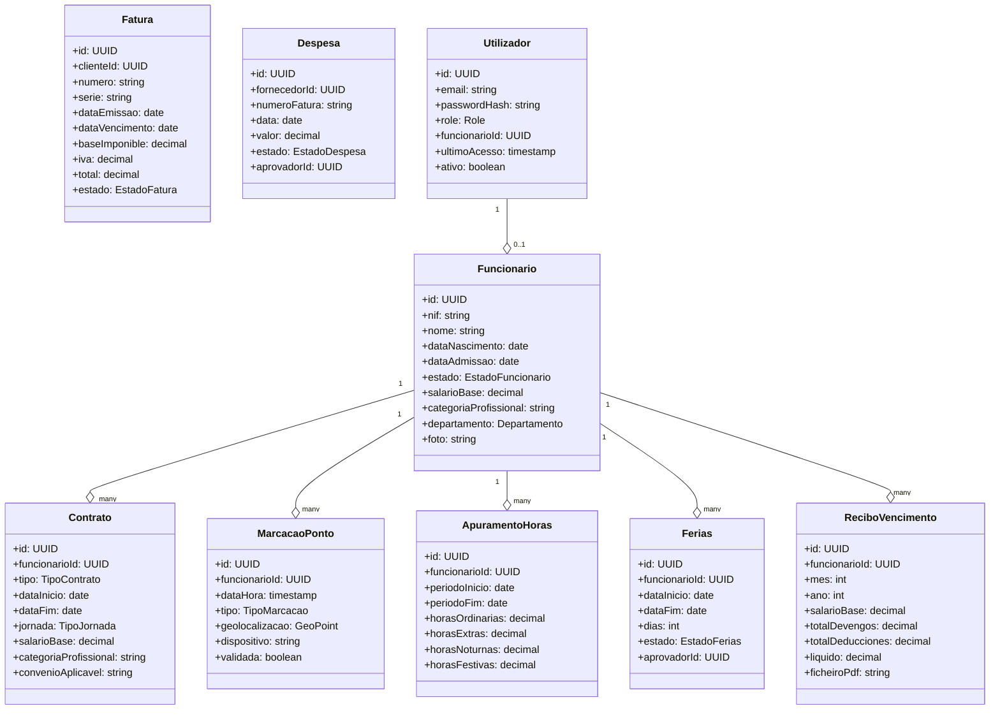
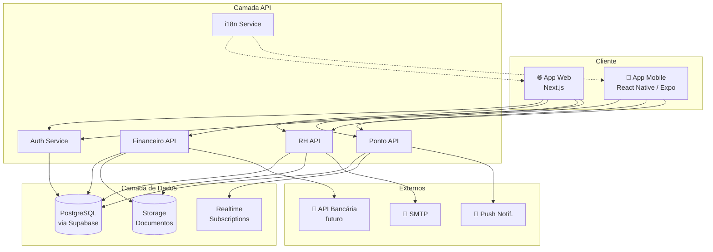
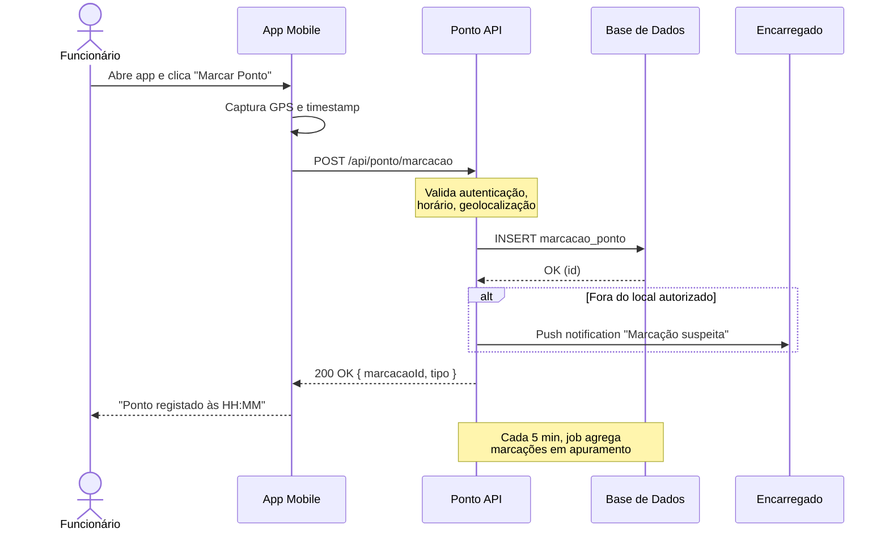
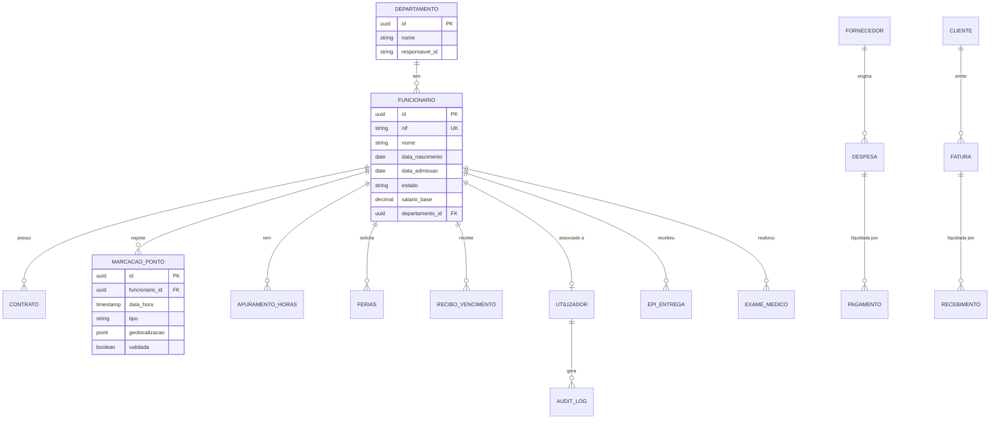

# Documento de Análise Funcional
## ERP para Matadouro — Sistema de Gestión Integral

**Versão:** 1.0
**Data:** 2026-07-31
**Autor:** Samuel Oliveira (Analista Funcional)
**Cliente:** Matadouro (Espanha) — ~100 funcionários
**Idioma do sistema:** Português (PT-BR) + Espanhol (ES)
**Idioma deste documento:** Português (PT-BR)

---

## 1. Introdução

### 1.1. Objetivo do documento
Este documento especifica, do ponto de vista funcional, os requisitos do **ERP Matadero**, sistema de informação destinado a apoiar a gestão de Recursos Humanos, Controle de Ponto/Horas, Financeiro e Processos Operacionais de um matadouro situado em Espanha, com aproximadamente 100 funcionários.

O documento serve como **base contratual** entre o cliente e a equipa de desenvolvimento, e como **referência para todas as fases seguintes** do projeto (design, implementação, testes, homologação).

### 1.2. Âmbito (Scope)
**Incluído no MVP (Fase 1):**
- Módulo de Recursos Humanos (RH)
- Controle de Ponto e Horas Trabalhadas
- Módulo Financeiro básico
- Autenticação, perfis e permissões
- Aplicação Web (responsiva) e Aplicação Mobile
- Suporte bilingue PT-BR / ES

**Fora do âmbito (fases seguintes):**
- Rastreabilidade animal (HACCP completo)
- Integração com sistemas oficiais espanhóis (REMO, SILUM)
- Contabilidade oficial avançada
- BI / Data Warehouse

### 1.3. Definições, acrónimos e abreviaturas

| Sigla | Significado |
|---|---|
| ERP | Enterprise Resource Planning |
| RH | Recursos Humanos |
| EPI | Equipamento de Proteção Individual |
| NIF | Número de Identificação Fiscal (Espanha) |
| CIF | Código de Identificação Fiscal (empresas) |
| SS | Segurança Social |
| HACCP | Hazard Analysis and Critical Control Points |
| SANDACH | Subproductos Animales No Destinados a Consumo Humano |
| MVP | Minimum Viable Product |
| UC | Caso de Uso (Use Case) |
| RN | Regra de Negócio |
| RNF | Requisito Não-Funcional |
| RGPD | Reglamento General de Protección de Datos |

---

## 2. Descrição Geral do Sistema

### 2.1. Visão do produto
O **ERP Matadero** é uma plataforma integrada, acessível via web e mobile, desenhada especificamente para matadouros de média dimensão (50–200 funcionários). Centraliza toda a informação operacional, de pessoal e financeira, garantindo:

- Conformidade legal com a legislação laboral espanhola
- Rastreabilidade das operações (preparação para HACCP na Fase 2)
- Eficiência administrativa (redução de tarefas manuais)
- Informação em tempo real para tomada de decisão

### 2.2. Personas e tipos de utilizador

| Persona | Perfil | Necessidades principais |
|---|---|---|
| **Administrador** | Responsável de TI / gerente | Configurar sistema, gerir utilizadores, ver tudo |
| **Responsável de RH** | Gestor de RH | Cadastros, contratos, recibos, férias, relatórios |
| **Responsável Financeiro** | Controller / contabilista | Lançamentos, pagamentos, relatórios, conciliação |
| **Encarregado de Produção** | Supervisor de chão de fábrica | Aprovar horas, gerir turnos, ocorrências |
| **Funcionário** | Operador do matadouro | Marcar ponto, ver recibos, solicitar férias |
| **Auditor** | Auditor interno/externo | Acesso read-only a relatórios e logs |

### 2.3. Restrições e premissas

**Restrições:**
- O sistema deve cumprir o **Real Decreto 8/2019** (registo horário obrigatório em Espanha)
- Deve respeitar o **RGPD** (proteção de dados)
- O cliente opera em **Espanha** — legislação laboral e fiscal espanhola

**Premissas:**
- O cliente dispõe de ligação à internet estável
- Existe infraestrutrura mínima (1 PC por encarregado, smartphones dos funcionários)
- A equipa interna do cliente dará formação aos utilizadores
- Haverá **1 ambiente de produção** e **1 ambiente de testes**

---

## 3. Requisitos Funcionais (RF)

### 3.1. Módulo RH — Gestão de Funcionários

#### RF-RH-001 — Cadastro de Funcionário
**Descrição:** O sistema deve permitir o cadastro completo de funcionários.

**Atributos obrigatórios:**
- Dados pessoais (nome, NIF, NIE ou passaporte, data nascimento, nacionalidade, estado civil)
- Dados de contacto (morada, telefone, email, contacto emergência)
- Dados profissionais (data admissão, cargo, departamento, tipo contrato, jornada, salário base, categoría profissional segundo **Convenio Colectivo** aplicable)
- Dados bancários (IBAN)
- Documentos digitalizados (DNI, contrato, certificados médicos, EPI's entregues)
- Foto do funcionário
- **Campos específicos matadouro:** nº segurança social, mutua de acidentes, reconhecimento médico (data, validade, apto/não apto), EPI's atribuídos

**Regras de negócio:**
- **RN-RH-001:** NIF deve ser único no sistema e validado pelo algoritmo oficial espanhol
- **RN-RH-002:** A data de admissão não pode ser futura
- **RN-RH-003:** O salário base não pode ser inferior ao **Salario Mínimo Interprofesional (SMI)** vigente
- **RN-RH-004:** Funcionários em contacto com carne devem ter **reconhecimento médico válido** para iniciar/continuar a trabalhar

#### RF-RH-002 — Gestão de Contratos
- CRUD de contratos (indefinido, temporal, formação, prática, etc.)
- Histórico de alterações contratuais
- Alertas de fim de contrato (30, 15, 7 dias antes)

#### RF-RH-003 — Gestão de Férias e Ausências
- Solicitação de férias pelo funcionário (via mobile/web)
- Workflow de aprovação (Encarregado → RH)
- Calendário coletivo de férias
- Tipos de ausência: férias, baixa médica (IT), licença, assuntos próprios, greve
- Cálculo automático de dias restantes conforme legislação espanhola (mínimo 30 dias naturais/ano)

**RN-RH-005:** Pelo menos **15 dias** de férias devem ser gozados consecutivamente dentro do período de verão (junho-setembro), salvo acordo.

#### RF-RH-004 — Recibos de Vencimento (Nómina)
- Geração mensal automática de recibos em PDF (formato oficial espanhol)
- Cálculo de: salário base, complementos, horas extras, descontos (SS, IRPF, outros)
- **Conformidade com:** Estatuto de los Trabajadores, Convenio Colectivo aplicable
- Envio por email + disponível na app
- Download em lote (zip) por RH

#### RF-RH-005 — Cessação (Finiquito)
- Cálculo automático de finiquito conforme tipo de cessação
- Geração de documento oficial
- Atualização de estado do funcionário

---

### 3.2. Módulo de Ponto e Horas

#### RF-PT-001 — Marcação de Ponto
**Descrição:** O sistema deve permitir o registo de entrada/saída dos funcionários.

**Modalidades:**
- Via **app mobile** (com geolocalização opcional)
- Via **web** (em quiosque ou PC do encarregado)
- Via **PIN numérico** ou **biometria** (futuro — fase 2)

**Atributos de cada marcação:**
- Funcionário
- Data/hora (timestamp UTC + offset local)
- Tipo (entrada, saída, pausa almoço, saída emergência)
- Geolocalização (se mobile)
- IP / dispositivo (auditoria)

**Regras de negócio:**
- **RN-PT-001:** Marcação deve respeitar jornada contratada (alerta de excesso)
- **RN-PT-002:** Marcação fora do local autorizado → alerta ao encarregado (não bloqueia)
- **RN-PT-003:** Período mínimo entre marcações consecutivas: 60 segundos (evitar duplo registo)

#### RF-PT-002 — Cálculo de Horas Trabalhadas
- Apuramento diário, semanal e mensal
- Horas ordinárias vs extras (com limites legais: máx 80h/ano según Estatuto)
- Horas noturnas (22h–06h — plus según Convenio)
- Horas em dias festivos
- **Banco de horas** (compensação opcional)

**RN-PT-004:** Horas extras devem ser **pré-aprovadas** pelo encarregado (workflow)

#### RF-PT-003 — Turnos e Escalas
- Planeamento mensal de turnos (matutino, vespertino, noturno)
- Atribuição por funcionário/departamento
- Visualização em calendário
- Trocas de turno (com aprovação)
- Exportação para impressão

#### RF-PT-004 — Relatórios de Ponto (cumprimento RD 8/2019)
- Relatório mensal por funcionário com totais de horas
- Exportação para inspeção de trabalho (formato CSV/XML estándar)
- **Retenção mínima:** 4 anos (RD 8/2019)

---

### 3.3. Módulo Financeiro

#### RF-FN-001 — Plano de Contas
- Estrutura de contas (Ativo, Passivo, Capital, Receitas, Despesas)
- Cadastro de contas contábeis (código, descrição, tipo)
- Associação com categorias operacionais

#### RF-FN-002 — Contas a Pagar
- Cadastro de fornecedores (com NIF/CIF validados)
- Lançamento de faturas de despesa
- Workflow de aprovação (solicitante → aprovador → pagamento)
- Agendamento de pagamentos
- Integração bancária (exportação de ficheiros SEPA,将来的 integração PSD2)

#### RF-FN-003 — Contas a Receber
- Cadastro de clientes
- Emissão de faturas (com série e numeração conforme regulamentação espanhola)
- Fatura eletrónica (FacturaE — formato XML obligatorio para administraciones públicas)
- Controlo de cobrança (estados: pendente, pago, vencido)
- Avisos automáticos de vencimento (3, 7, 15 dias)

#### RF-FN-004 — Tesouraria (Fluxo de Caixa)
- Registo de movimentos bancários
- Conciliação bancária manual (matching com extrato CSV)
- Previsão de fluxo de caixa
- Saldos por conta bancária

#### RF-FN-005 — Relatórios Financeiros
- Balanço de verificação
- Demonstração de resultados (P&L)
- Fluxo de caixa
- Contas a pagar/receber (aging report)
- Exportação para Excel/PDF

**RN-FN-001:** Numeração de faturas deve ser **sequencial e sem lacunas** (regulamentação AEAT)

---

### 3.4. Funcionalidades Transversais

#### RF-TR-001 — Autenticação e Autorização
- Login com email + senha
- Recuperação de senha por email
- Autenticação de 2 fatores (2FA) para perfis sensíveis
- Sessões com timeout (30 min inactividade)

#### RF-TR-002 — Gestão de Utilizadores e Permissões
- CRUD de utilizadores
- Roles predefinidos (ver secção 2.2)
- Permissões granulares por módulo/ação
- Audit log (registo de todas as ações)

#### RF-TR-003 — Notificações
- Push notifications (app mobile)
- Email
- In-app
- Configurável por tipo de evento e por utilizador

#### RF-TR-004 — Internacionalização
- Interface em PT-BR e ES (seleção automática por browser/dispositivo + manual)
- Datas e números conforme locale
- Textos traduzíveis (arquivos .json)
- Documentos gerados (recibos, faturas) no idioma do funcionário

#### RF-TR-005 — Auditoria e Logs
- Registo de: quem fez o quê, quando, de onde (IP)
- Retenção de logs: mínimo 4 anos (cumprimento fiscal)
- Visualização por Admin/Auditor
- Exportação

---

## 4. Requisitos Não-Funcionais (RNF)

### 4.1. Desempenho
- **RNF-001:** Tempo de resposta < 2s para 95% das operações
- **RNF-002:** Suportar 100 utilizadores concorrentes sem degradação
- **RNF-003:** App mobile funcional em redes 3G (modo leitura)

### 4.2. Segurança
- **RNF-004:** Comunicação encriptada (TLS 1.3 mínimo)
- **RNF-005:** Senhas armazenadas com hash (bcrypt, custo ≥ 12)
- **RNF-006:** Proteção contra SQL Injection, XSS, CSRF
- **RNF-007:** Cumprimento do RGPD: consentimento explícito, direito ao esquecimento, portabilidade
- **RNF-008:** Backups diários automáticos, retenção 30 dias, encriptados

### 4.3. Disponibilidade
- **RNF-009:** SLA de disponibilidade: 99% durante horário laboral
- **RNF-010:** Estratégia de disaster recovery (RPO ≤ 24h, RTO ≤ 4h)

### 4.4. Usabilidade
- **RNF-011:** Interface intuitiva, curva de aprendizagem < 2 horas para utilizadores básicos
- **RNF-012:** Acessibilidade WCAG 2.1 nível AA
- **RNF-013:** Design responsivo (mobile-first para app, adaptativo para web)

### 4.5. Manutenibilidade
- **RNF-014:** Cobertura de testes ≥ 70%
- **RNF-015:** Código documentado (TSDoc/JSDoc)
- **RNF-016:** CI/CD automatizado

### 4.6. Compatibilidade
- **RNF-017:** Navegadores: últimas 2 versões de Chrome, Firefox, Edge, Safari
- **RNF-018:** Mobile: Android 9+, iOS 14+
- **RNF-019:** Funcionar em ecrãs de 320px a 4K

### 4.7. Conformidade Legal
- **RNF-020:** Cumprimento do RGPD (Regulamento UE 2016/679)
- **RNF-021:** Cumprimento da **LOPDGDD** (Ley Orgánica 3/2018 — España)
- **RNF-022:** Cumprimento do **Real Decreto 8/2019** (registo horário)
- **RNF-023:** Cumprimento de regulamentação fiscal espanhola (IVA, IRPF, SS)

---

## 5. Casos de Uso (UML — Diagrama)

```mermaid
graph TB
    subgraph Sistema["Sistema ERP Matadero"]
        UC01[UC01: Gerir Funcionários]
        UC02[UC02: Gerir Contratos]
        UC03[UC03: Solicitar Férias]
        UC04[UC04: Aprovar Férias]
        UC05[UC05: Gerar Recibo de Vencimento]
        UC06[UC06: Marcar Ponto]
        UC07[UC07: Consultar Marcações]
        UC08[UC08: Aprovar Horas Extras]
        UC09[UC09: Gerir Turnos]
        UC10[UC10: Emitir Fatura]
        UC11[UC11: Lançar Despesa]
        UC12[UC12: Conciliar Banco]
        UC13[UC13: Gerir Utilizadores]
        UC14[UC14: Consultar Relatórios]
    end

    Admin((Admin))
    RH((Responsável RH))
    Fin((Responsável Fin.))
    Enc((Encarregado))
    Func((Funcionário))
    Aud((Auditor))

    Admin --> UC13
    RH --> UC01
    RH --> UC02
    RH --> UC03
    RH --> UC04
    RH --> UC05
    RH --> UC09
    RH --> UC14
    Fin --> UC10
    Fin --> UC11
    Fin --> UC12
    Fin --> UC14
    Enc --> UC04
    Enc --> UC07
    Enc --> UC08
    Enc --> UC09
    Func --> UC03
    Func --> UC06
    Func --> UC07
    Aud --> UC14
    Aud --> UC07
```

---

## 6. Diagrama de Classes de Domínio

---

## 7. Diagrama de Arquitetura (3 camadas)

---

## 8. Diagrama de Sequência — Marcação de Ponto

---

## 9. Diagrama Entidade-Relacionamento (ER) Resumido

---

## 10. Regras de Negócio (Consolidado)

| Código | Descrição |
|---|---|
| **RN-RH-001** | NIF deve ser único e válido (algoritmo espanhol) |
| **RN-RH-002** | Data admissão não pode ser futura |
| **RN-RH-003** | Salário base ≥ SMI vigente |
| **RN-RH-004** | Funcionários em produção: reconhecimento médico válido |
| **RN-RH-005** | Mínimo 15 dias férias consecutivas em jun-set |
| **RN-PT-001** | Jornada diária conforme contrato (alerta de excesso) |
| **RN-PT-002** | Marcação fora do local → alerta (não bloqueia) |
| **RN-PT-003** | Mínimo 60s entre marcações consecutivas |
| **RN-PT-004** | Horas extras devem ser pré-aprovadas |
| **RN-FN-001** | Numeração de faturas sequencial e sem lacunas |

---

## 11. Critérios de Aceitação (resumo por módulo)

### 11.1. RH
- ✅ Cadastrar funcionário com todos os campos obrigatórios + validação NIF
- ✅ Upload de documentos (PDF, JPG, PNG até 10MB)
- ✅ Solicitar férias via app e aprovar via web em < 5 cliques
- ✅ Gerar recibo mensal em PDF oficial espanhol em < 30s

### 11.2. Ponto
- ✅ Marcar ponto em < 3 segundos (app mobile, 3G)
- ✅ Funcionar offline (sincronizar quando voltar online)
- ✅ Relatório de horas mensais exportável em CSV
- ✅ Cálculo de horas extras conforme Convenio

### 11.3. Financeiro
- ✅ Emitir fatura com numeração sequencial automática
- ✅ Validar NIF/CIF do cliente/fornecedor
- ✅ Conciliação bancária por matching de CSV
- ✅ Exportar ficheiro SEPA para pagamentos

---

## 12. Riscos e Mitigações

| Risco | Probabilidade | Impacto | Mitigação |
|---|---|---|---|
| Legislação espanhola muda | Média | Alto | Camada de regras de negócio isolada, fácil de atualizar |
| Resistência dos funcionários ao app | Média | Médio | Formação + UI simples + modo offline |
| Cliente sem boa infraestrutura IT | Alta | Médio | Cloud (Supabase) reduz dependência local |
| Prazo apertado | Média | Alto | MVP focado, fases bem definidas |
| Dados sensíveis (RGPD) | Alta | Crítico | Encriptação, 2FA, audit log, DPA assinado |

---

## 13. Glossário

- **Convenio Colectivo:** Acordo coletivo de trabalho que define categorias, salários e condições num setor
- **SMI:** Salario Mínimo Interprofesional (atualmente 1.134€/mês em 14 pagamentos — 2026)
- **Finiquito:** Indemnização e valores devidos no término do contrato
- **Mutua:** Entidade colaboradora da Segurança Social para gestão de acidentes de trabalho
- **EPI:** Equipamento de Proteção Individual
- **NIE:** Número de Identidad de Extranjero (para não-espanhóis)
- **SEPA:** Single Euro Payments Area

---

## 14. Aprovação

| Papel | Nome | Data | Assinatura |
|---|---|---|---|
| Analista Funcional | Samuel Oliveira | 2026-07-31 | _____________ |
| Cliente (Representante) | _____________ | _____________ | _____________ |
| Desenvolvedor Lead | _____________ | _____________ | _____________ |

---

**Fim do Documento de Análise Funcional v1.0**
